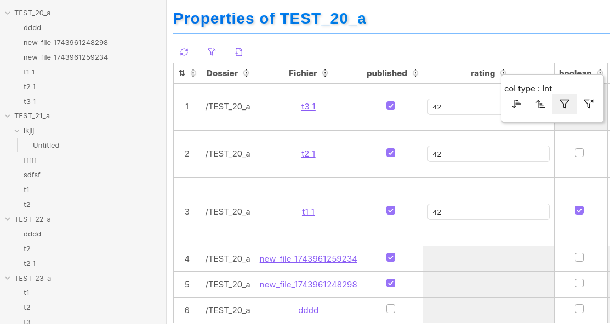

# Obsidian Plugin: obsidian-properties-view

## EN DEVELOPPEMENT...

## 🚀 Overview
This Obsidian plugin allows users to efficiently manage YAML properties within markdown notes.
It enables direct editing of properties, lists, and numerical values while ensuring the YAML structure remains clean and organized.

## 🛠️ Installation
The Usual.

## 📌 Usage
- **Right clic on a directory -> Properties that folder.

## 📝 Contributing
Feel free to contribute by submitting pull requests or reporting issues!

## 📜 License
This project is licensed under the MIT License.

---
Made with ❤️ for Obsidian users.

